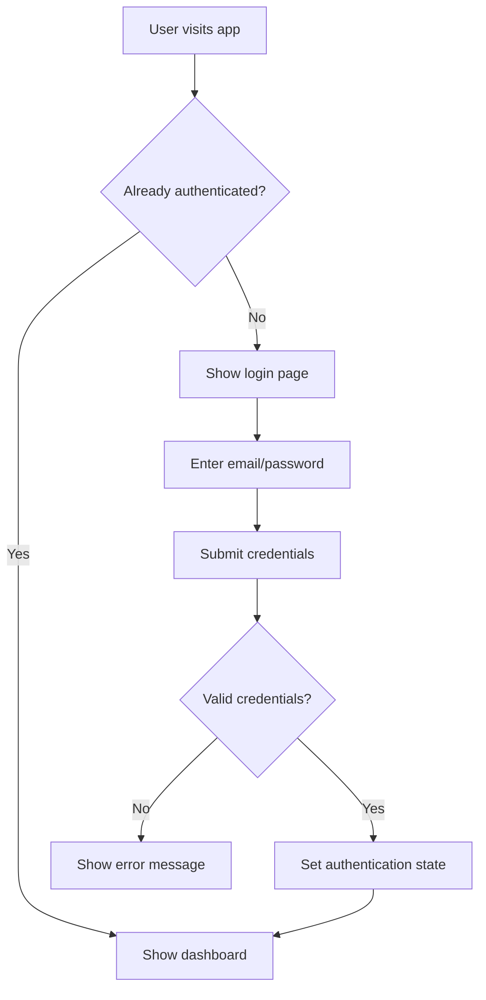
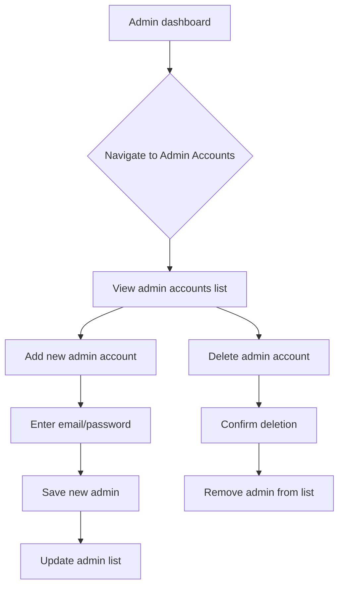

# Authentication System Architecture

## Overview
This document describes the improved authentication system for the admin dashboard, which will include email/password authentication and separate admin account management.

## Components

### 1. Login Component
- Email and password input fields
- Form validation
- Authentication service integration
- Error handling

### 2. Authentication Service
- Validate email/password credentials
- Manage authentication state
- Handle localStorage persistence
- Provide authentication status to other components

### 3. Admin Accounts Management
- View existing admin accounts
- Add new admin accounts
- Delete admin accounts
- Update admin account details

### 4. Route Protection
- Protect admin-only routes
- Redirect unauthenticated users to login

## Data Structure

### Admin Account Object
```javascript
{
  id: string,
  email: string,
  password: string, // Will be hashed in real implementation
  createdAt: Date,
  lastLogin: Date
}
```

### Initial Dummy Data
```javascript
const initialAdminAccounts = [
  {
    id: '1',
    email: 'admin@twinkklesdrop.com',
    password: 'admin123',
    createdAt: new Date('2023-01-01'),
    lastLogin: new Date('2023-01-01')
  },
  {
    id: '2',
    email: 'superadmin@twinkklesdrop.com',
    password: 'superadmin123',
    createdAt: new Date('2023-01-01'),
    lastLogin: new Date('2023-01-01')
  }
];
```

### Storage
Admin accounts will be stored in localStorage with the key `adminAccounts`. On first load, if no accounts exist, the initial dummy data will be used.

## Authentication Flow



## Admin Management Flow



## Implementation Plan

1. Update Login component to support email/password authentication
2. Create authentication service with localStorage persistence
3. Implement admin accounts data structure with dummy data
4. Create AdminAccounts component for managing admin users
5. Create AddAdmin component for adding new admin accounts
6. Update Sidebar navigation to include admin management pages
7. Add route protection for admin-only pages